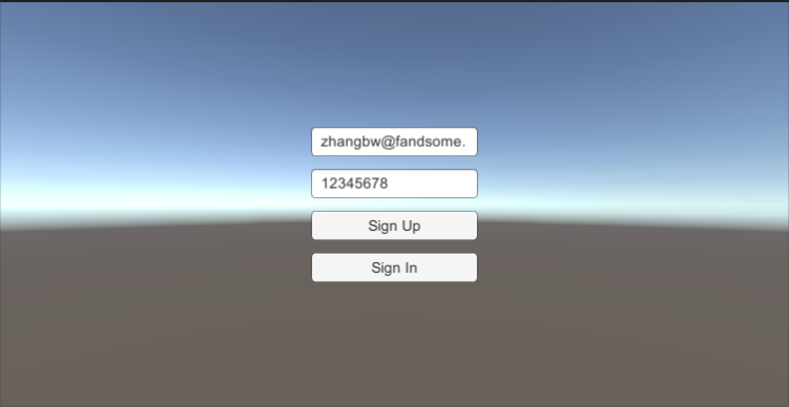
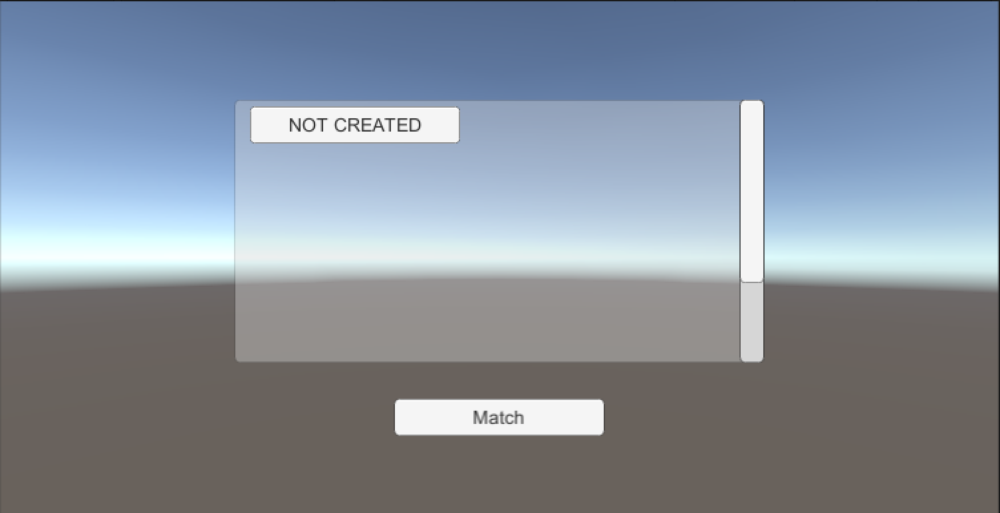
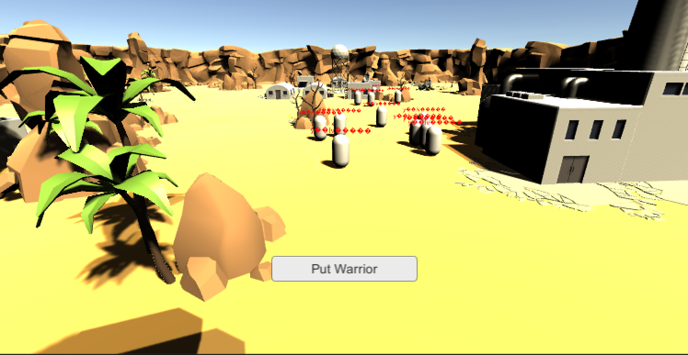

# NAKAMA DEMO

Demo to learn contents of Nakama. Put warriors and attack with each other.

1. Register and Login
1. Enter room and send topic
1. Match and OnMatchData

## Install

1. Install nakama.
1. Open this demo, change `default_key` and `Host` in `Assets/Scripts/MultiPlayerDemo/AccountService.cs`.
1. Build and run two clients.

## Snapshots

1. Rgister & Login

1. Match

1. Attack

